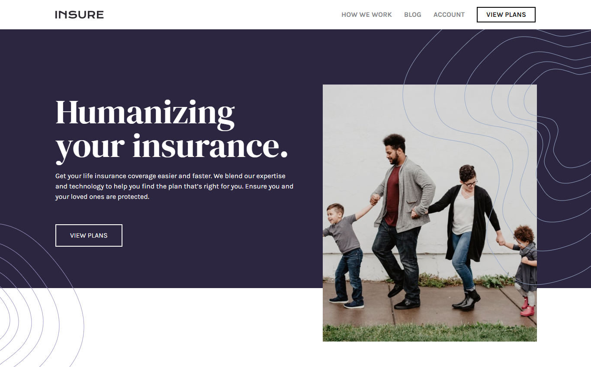
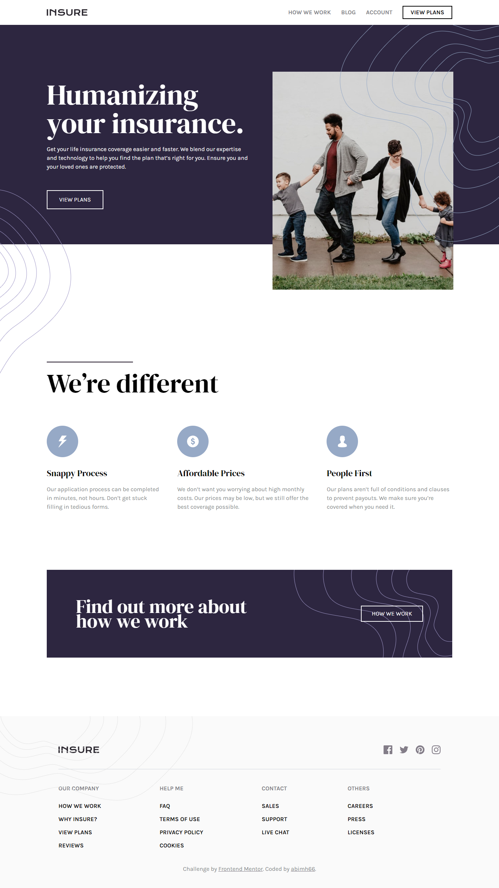
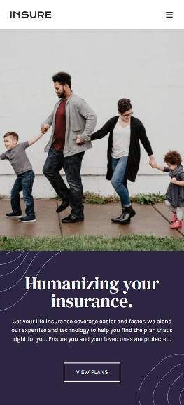

# Sunnyside Agency Landing Page

Project ini berdasarkan pada challenge di Frontend Mentor [Insure landing page challenge on Frontend Mentor](https://www.frontendmentor.io/challenges/insure-landing-page-uTU68JV8).

## Daftar Isi

- [Overview](#overview)
  - [Penjelasan Project](#the-challenge)
  - [Screenshot](#screenshot)
  - [Links](#links)
- [Proses](#proses)
  - [Stack yang digunakan](#stack-yang-digunakan)
  - [Hal yang dipelajari](#hal-yang-dipelajari)
  - [Resources](#resources)
- [Author](#author)

## Overview

### Penjelasan Project

Pada project ini saya membangun sebuah landing page yang semirip mungkin dengan desain yang diberikan oleh Frontend Mentor.
Fokus utama pada project ini adalah HTML dan CSS, dengan tambahan javascript. Saya menambahkan burger menu untuk mobile view
Objektif pada project ini:

- Menampilkan layout yang sesuai dengan ukuran layar(responsive)
- Memberikan interaksi pada web(_hover_)

### Screenshot

**Tampilan Desktop**

**Tampilan Mobile** 

### Links

- Solution URL: [Solution Codee](https://github.com/abimh66/insure-landing-page-frontendmentor)
- Live Site URL: [live site](https://insure-abimh66.netlify.app/)

## Proses

### Stack yang digunakan

- Semantic HTML5 markup
- [Tailwind CSS](https://tailwindcss.com/) - CSS Framework
- Flexbox
- Mobile-first workflow
- Vanilla JavaScript

### Hal yang dipelajari

Banyak hal yang dipelajari dari project ini terutama adalah framework Tailwind CSS. Membuat responsive web menjadi sangat mudah dengan menggunakan Tailwind CSS. Saya juga belajar memeberikan animasi pada navbar di mobile view.

### Resources

- [Tailwind CSS Documentation](https://tailwindcss.com/docs/installation)
- [Mozilla MDN JavaScript Documentation](https://developer.mozilla.org/en-US/docs/Web/JavaScript)

## Author

- Website - [abiproject.com](https://www.abiproject.com)
- Frontend Mentor - [@abimh66](https://www.frontendmentor.io/profile/abimh66)
- Codewars - [@abimh66](https://www.codewars.com/users/abimh66)
- Twitter - [@abimhrdnt](https://www.twitter.com/abimhrdnt)
